# How to Efficiently Use Ultralytics YOLO in RDK's Robot Operating System (ROS)？

## Abstract

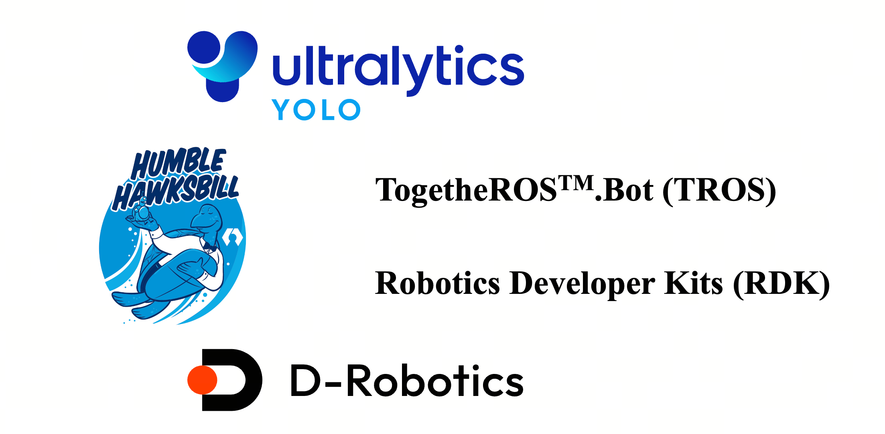

- Ultralytics YOLO is an open-source algorithm framework that allows for very easy and efficient training of custom algorithm models.  
- RDK is the robot development kit for DiGua robots, on which the RDK OS based on Ubuntu 22.04 can be run. Additionally, TROS based on ROS 2 Humble can also be executed, making efficient use of the RDK's heterogeneous computing capabilities, and can be easily integrated into other robotic systems built with ROS 2.  
- RDK Model Zoo maintains exported ONNX versions of most Ultralytics YOLO models, converts them into ROS 2 nodes in TROS for efficient algorithm inference, and provides documentation along with Python and C++ APIs for using YOLO algorithm models.

## Demo Videos

### RDK S100 Plus / RDK S100

#### S100: YOLO11x, 640x640, 80 Classes, e2e 110FPS

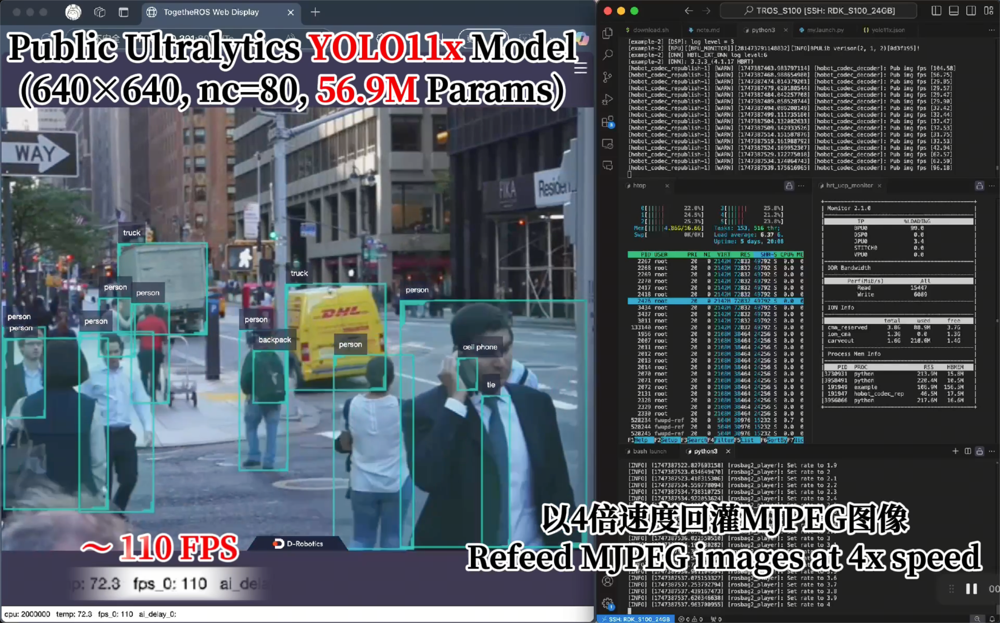

- [BiliBili](https://www.bilibili.com/video/BV1EUE4zgE2V)
- [Youtube](https://www.youtube.com/watch?v=GeHY4D59PnU)

#### S100: YOLO12n, 1280x1280, 80 Classes, e2e 30FPS

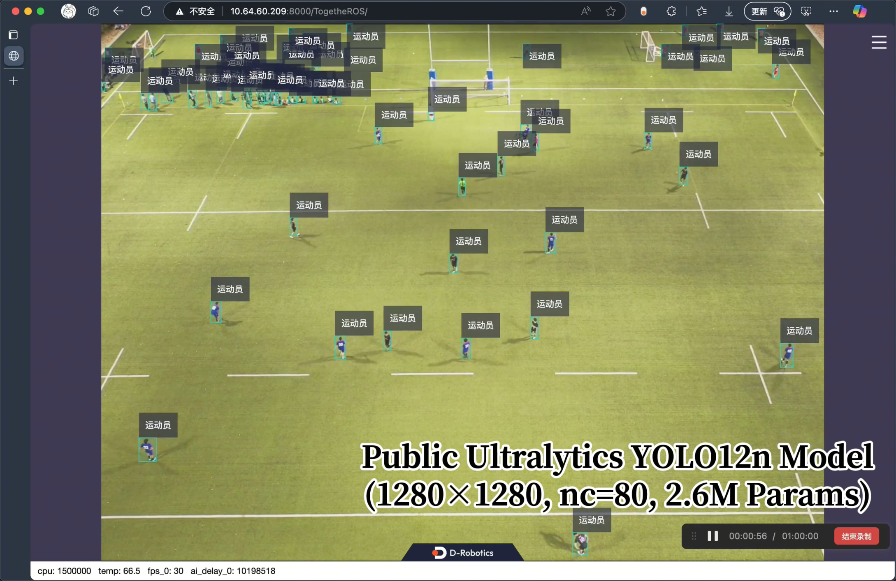

- [BiliBili](https://www.bilibili.com/video/BV1JyjGzfEEW)
- [Youtube](https://www.youtube.com/watch?v=PAP8rTfv4og)

#### S100: 8 Channel YOLO12n, 640x640, 80 Classes, e2e 8 x 30 FPS

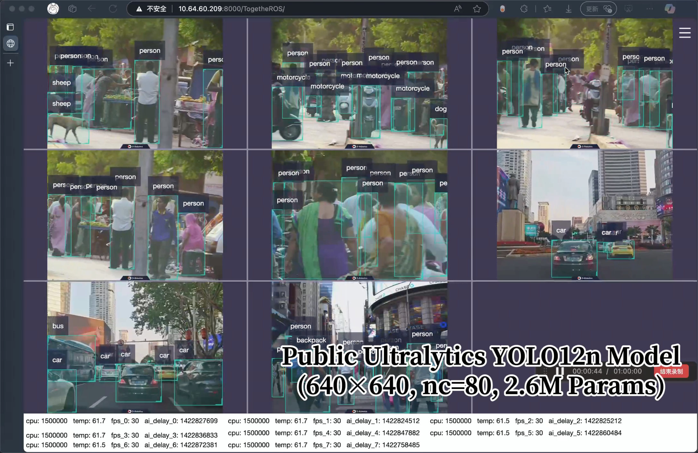

- [BiliBili](https://www.bilibili.com/video/BV1RXjGzpEBU)
- [Youtube](https://www.youtube.com/watch?v=vVFwuFYN3KA)

#### S100: YOLOE 11 l Seg, Prompt Free, 640x640, 4585 Classes, e2e 30FPS

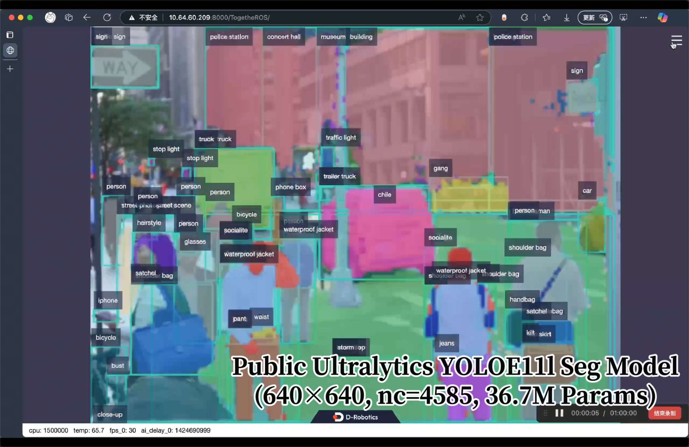

- [BiliBili](https://www.bilibili.com/video/BV1EyjGzfEy6)
- [Youtube](https://www.youtube.com/watch?v=8qkSbUNlfNw)

### RDK X5

#### X5: YOLO11n, 640x640, 80 Classes, e2e 200FPS

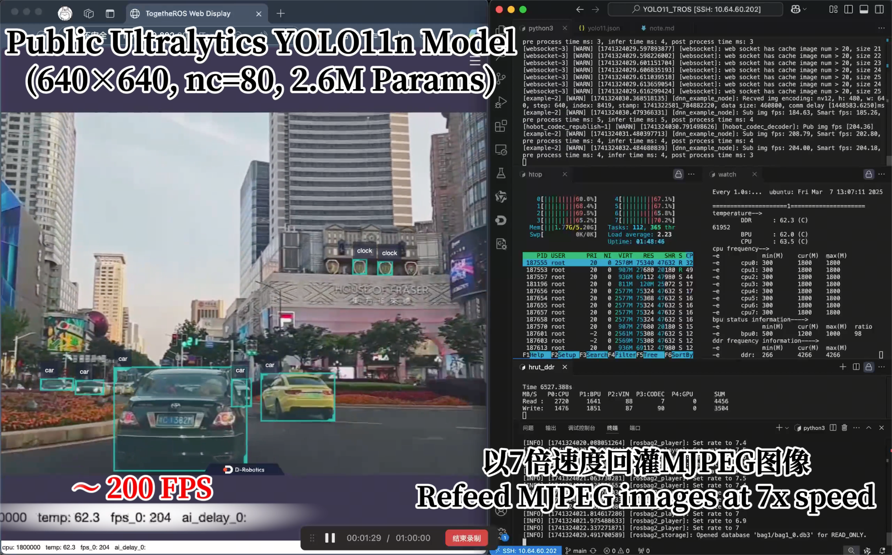

- [BiliBili](https://www.bilibili.com/video/BV1NN91Y1EBP)
- [Youtube](https://www.youtube.com/watch?v=uWW0bd0FZ-4)

#### X5: YOLOv8n, 640x640, 80 Classes, e2e 220FPS

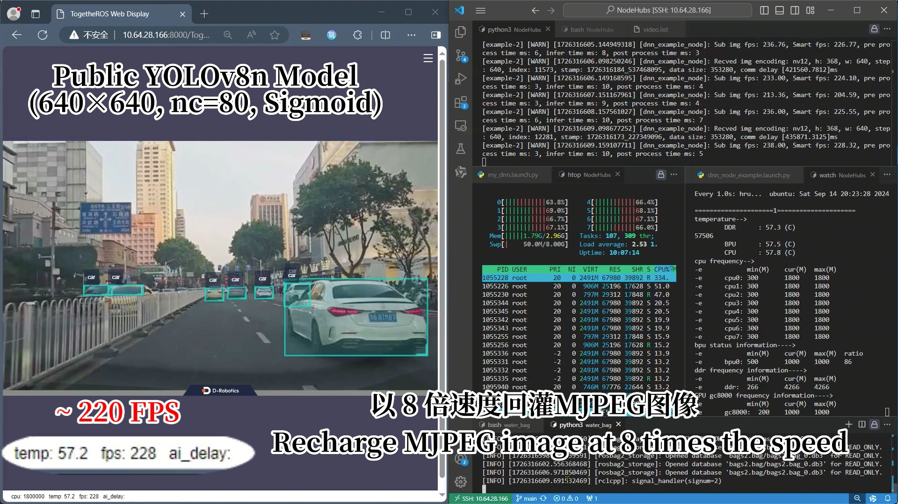

- [BiliBili](https://www.bilibili.com/video/BV12h41eYEer)
- [Youtube](https://www.youtube.com/watch?v=H11J3lWZZsY)

#### X5: YOLOv8n Seg, 640x640, 80 Classes, e2e 166FPS

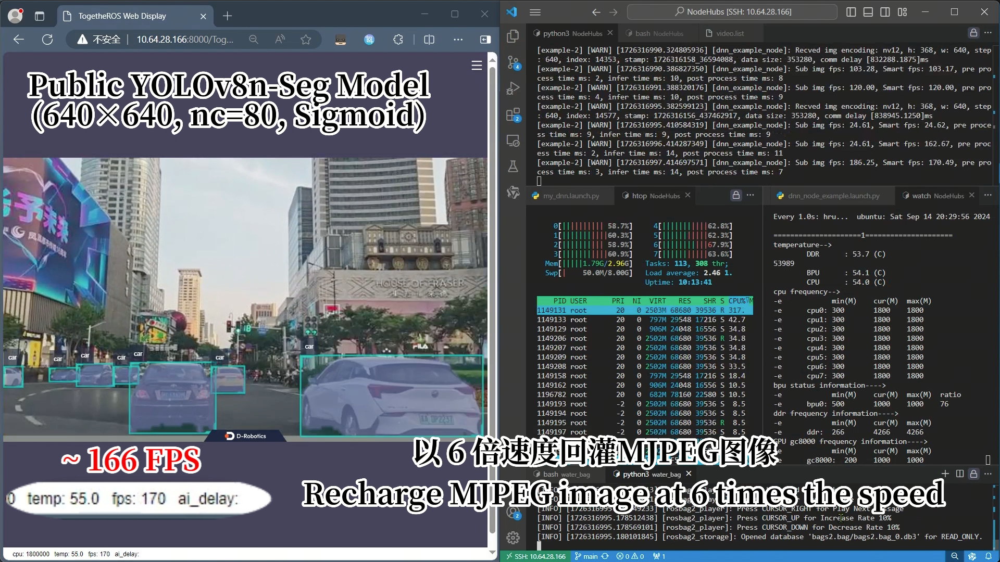

- [BiliBili](https://www.bilibili.com/video/BV1xE4UeuEJh)
- [Youtube](https://www.youtube.com/watch?v=4YyhO8oDpZE)

## Introduction to ROS2

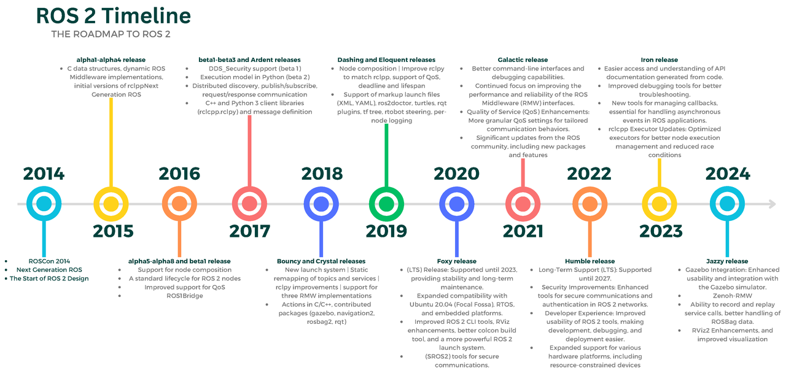

The Robot Operating System (ROS) is a set of software libraries and tools for building robot applications.  From drivers and state-of-the-art algorithms to powerful developer tools, ROS has the open source tools you need for your next robotics project.

Since ROS was started in 2007, a lot has changed in the robotics and ROS community.  The goal of the ROS 2 project is to adapt to these changes, leveraging what is great about ROS 1 and improving what isn’t.

Each node in ROS should be responsible for a single modular purpose (for example, one node for controlling the wheel motors, one node for controlling the laser rangefinder, etc.). Nodes can send and receive data to and from other nodes through topics, services, actions, or parameters. A complete robotic system consists of many nodes working together.

The developers of these nodes can be hardware vendors, software vendors, algorithm engineers, robotic engineers, and so on. As long as the nodes we develop comply with ROS 2 standards, they can be easily integrated into a larger robotic system.

- [ROS](https://www.ros.org/)
- [ROS2 English Document](https://docs.ros.org/en/rolling/index.html)
- [ROS2 Chinese Document by FishROS Community](http://dev.ros2.fishros.com/doc/)  
- [GuYueHone ROS  Community](https://www.guyuehome.com/)
- [BiliBili ROS2 21 tutorials](https://www.bilibili.com/video/BV16B4y1Q7jQ/)
- [Document ROS2 21 tutorials](https://book.guyuehome.com/)
- [Gitee ROS2 21 tutorials](https://gitee.com/guyuehome/ros2_21_tutorials/tree/master) 

## Introduction to Ultralytics YOLO

Introducing Ultralytics YOLO11, the latest version of the acclaimed real-time object detection and image segmentation model. YOLO11 is built on cutting-edge advancements in deep learning and computer vision, offering unparalleled performance in terms of speed and accuracy. Its streamlined design makes it suitable for various applications and easily adaptable to different hardware platforms, from edge devices to cloud APIs.

Ultralytics YOLO11 is a versatile AI framework that supports multiple computer vision tasks. The framework can be used to perform detection, segmentation, obb, classification, and pose estimation. Each of these tasks has a different objective and use case, allowing you to address various computer vision challenges with a single framework.

- [Ultralytics](https://www.ultralytics.com/)
- [Ultralytics YOLO Document](https://docs.ultralytics.com/)
- [Ultralytics YOLO GitHub](https://github.com/ultralytics/ultralytics)

We can use Ultralytics YOLO to train our own algorithm Model. After obtaining our own algorithm model, we can refer to RDK Model Zoo to transform it into a BPU model that TROS can run.

- [Ultralytics](https://www.ultralytics.com/)
- [Ultralytics YOLO Document](https://docs.ultralytics.com/)
- [Ultralytics YOLO GitHub](https://github.com/ultralytics/ultralytics)

## Introduction to D-Robotics RDK

### D-Robotics

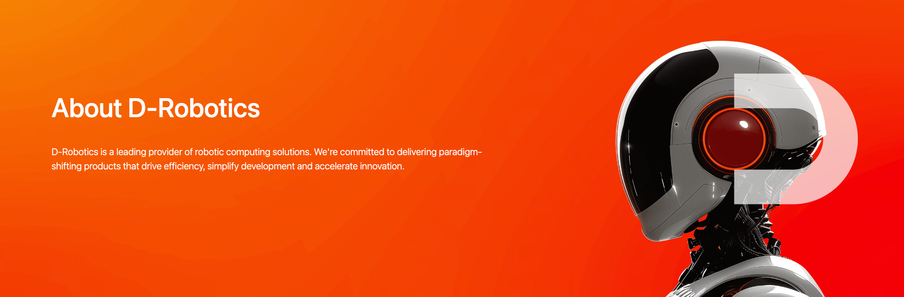

D-Robotics is a provider of foundational infrastructure dedicated to the intelligent evolution of robots. By offering high-performance computing chips and a full-stack development platform that integrates software and hardware as well as edge and cloud computing, DiGua Robotics comprehensively empowers robot development and large-scale deployment, bringing people a smarter and better experience.

- [D-Robotics Chinese Official Website](https://d-robotics.cc/)
- [D-Robotics English Official Website](https://en.d-robotics.cc/)
- [D-Robotics Developer Community](https://developer.d-robotics.cc/)

### RDK S100 Plus / RDK S100

- CPU: 6 x A78AE @ 2.0GHz / 6 x A78AE @ 1.5GHz
- BPU: 128TOPs @ int8 / 80TOPs @ int8
- DDR: LPDDR5@6400, 96bit / LPDDR5@6400, 96bit
- OS: RDK OS Based on Ubuntu 22.04

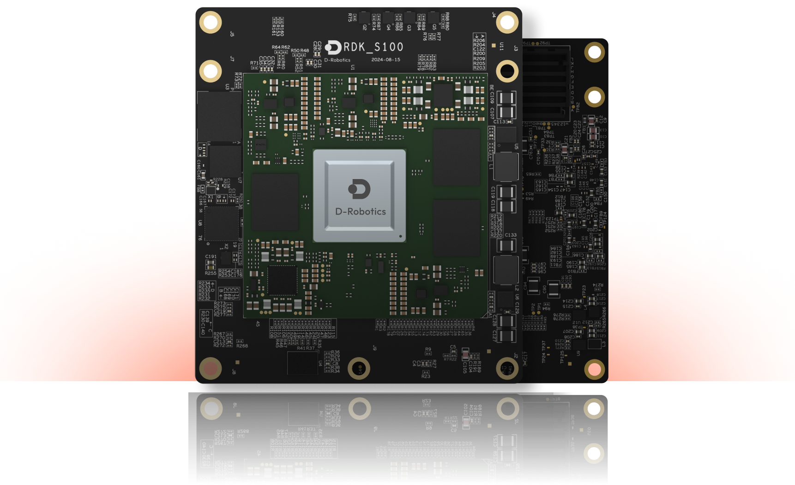

RDK S100 is a high-performance, high-computing-power module introduced by DiGua Robotics for embodied intelligence and robotic scenarios. Its unique heterogeneous design can simultaneously meet the demands of perception inference and real-time motion control, reducing the size and complexity of the control system.

- [RDK S100 (Chinese)](https://developer.d-robotics.cc/rdks100)

### RDK X5

- CPU: 8 x A55 @ 1.5 GHz
- BPU: 10 TOPs @ int8
- DDR: LPDDR4@4266, 32bit
- OS: RDK OS Based on Ubuntu 22.04

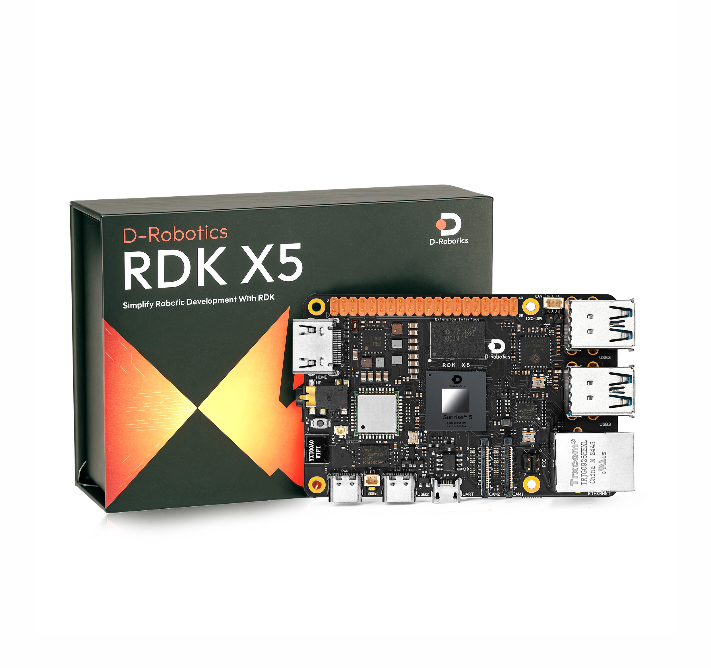

Powered by the 10 TOPS Sunrise 5 chip, the RDK X5 is an all-in-one development kit for intelligent computing and robotics. With versatile interfaces and support for advanced models like Transformer, RWKV, and Stereo Perception, it simplifies and accelerates the deployment of cutting-edge AI applications.

- [Introduction to RDK X5 (Chinese)](https://developer.d-robotics.cc/rdkx5)
- [Introduction to RDK X5 (English)](https://developer.d-robotics.cc/en/rdkx5)

## Inteoration to TogetheROS.Bot (TROS)

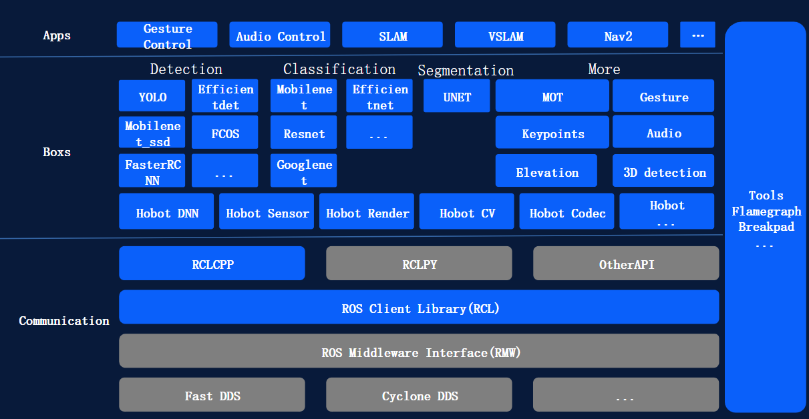

TogetheROS.Bot is a robot operating system introduced by D-Robotics for robot manufacturers and ecosystem developers. It aims to unlock the intelligent potential of robotic scenarios and help ecosystem developers and commercial customers efficiently and conveniently develop robots, enabling them to create competitive intelligent robot products.

TogetheROS.Bot supports operation on the RDK platform and also provides a simulator version that can run on the X86 platform. The RDK platform includes all the functionalities shown in the figure below, while the X86 platform allows partial functionality experience through image playback, improving user algorithm development and verification efficiency, and enabling rapid migration to the RDK platform.

We maintain more than 30 TROS packages, which are standard ROS 2 Humble nodes. The source code is hosted on GitHub under the organization D-Robotics, and repository names generally start with hobot_*.

- [GitHub](https://github.com/D-Robotics/)

### DataFlows

By combining standard ROS 2 Humble nodes, TROS can perform intelligent analysis on data from USB, MIPI, and IPC cameras. It also supports the development of multi-channel parallel video stream intelligent analysis applications.

#### RDK TROS USB Camera DataFlow

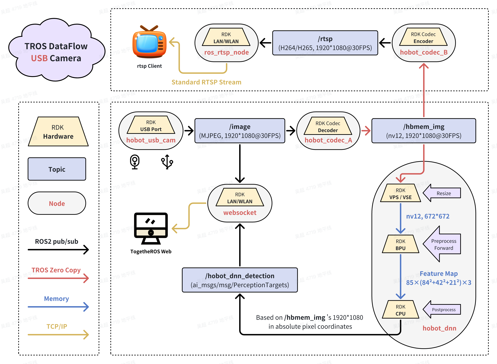

#### RDK TROS MIPI Camera DataFlow

#### RDK TROS IPC Camera DataFlow

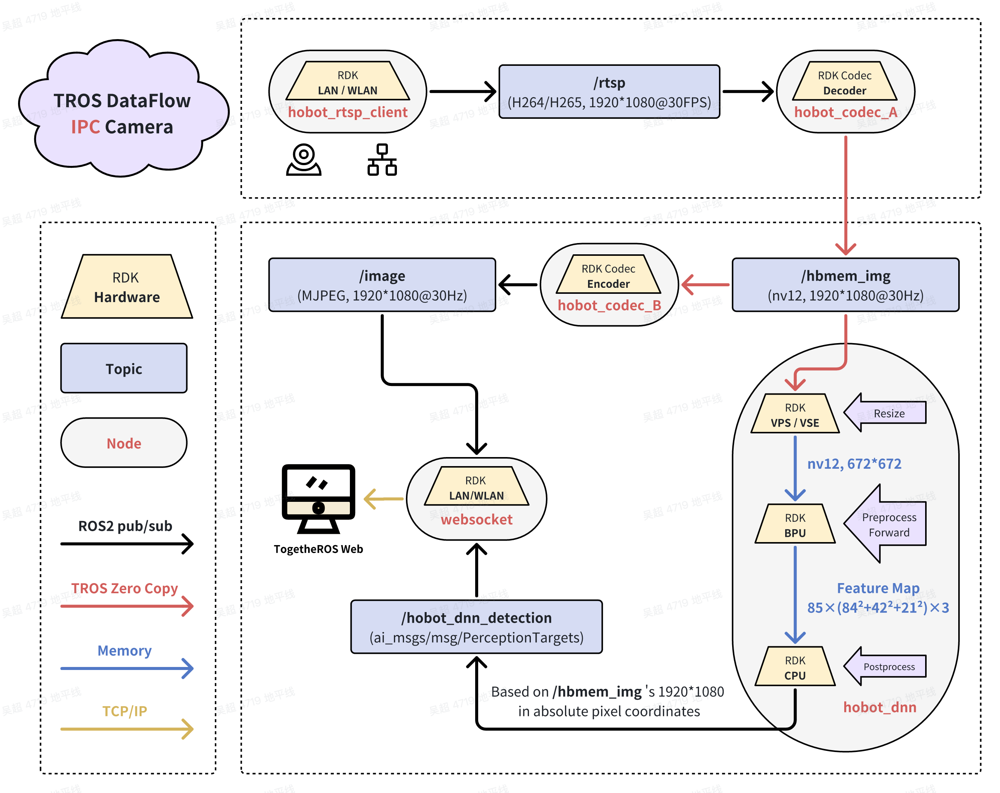

### TROS Packages and Nodes

#### IPC Camera Node (Important)

This node is responsible for converting the RTSP stream of H264/H265 from the IPC webcam into the ROS2 Topic.

- [TROS Document (Chinese Community)](https://developer.d-robotics.cc/rdk_doc/Robot_development/apps/video_boxs)
- [TROS Document (Git Hu b)](https://d-robotics.github.io/rdk_doc/en/Robot_development/apps/video_boxs/)
- [GitHub](https://github.com/D-Robotics/hobot_rtsp_client)

#### MIPI Camera Node

This node is responsible for converting the YUV420SP(NV12) images from the MIPI camera into ROS2 Topics. The MIPI camera of the ISP that has been debugged can be referred to the documentation.

- [TROS Document (Chinese Community)](https://developer.d-robotics.cc/rdk_doc/Robot_development/quick_demo/demo_sensor#mipi%E5%9B%BE%E5%83%8F%E9%87%87%E9%9B%86)
- [TROS Document (GitHub.io)](https://d-robotics.github.io/rdk_doc/en/Robot_development/quick_demo/demo_sensor/#mipi-camera)
- [GitHub](https://github.com/D-Robotics/hobot_mipi_cam)

#### USB Camera Node

This node is responsible for converting MJPEG images from the USB camera into ROS2 Topics, and by default, v4l2 is used for streaming.

- [TROS Document (Chinese Community)](https://developer.d-robotics.cc/rdk_doc/Robot_development/quick_demo/demo_sensor#usb%E5%9B%BE%E5%83%8F%E9%87%87%E9%9B%86)
- [TROS Document (GitHub.io)](https://d-robotics.github.io/rdk_doc/en/Robot_development/quick_demo/demo_sensor/#usb-camera)
- [GitHub](https://github.com/D-Robotics/hobot_usb_cam)

#### Codec Node

The Codec node is responsible for calling the hardware codec of RDK. Among them, the JPU can hardware-decode MJPEG as YUV420SP(NV12) and hardware-encode YUV420SP(NV12) as MJPEG, and the VPU can hardware-decode H264/H265 as YUV420SP(NV12). VPU can hardware-encode YUV420SP(NV12) as H264/H265.

| RDK | Performance | Max Instance |
| --- | --- | --- |
| S100 JPU | 4K@90fps | 64 |
| S100 VPU | 4K@90fps | 32 |
| X5 JPU | 4K@60fps | 64 |
| X5 VPU | 4K@60fps | 32 |

- [TROS Document (Chinese Community)](https://developer.d-robotics.cc/rdk_doc/Robot_development/quick_demo/hobot_codec)
- [TROS Document (GitHub.io)](https://d-robotics.github.io/rdk_doc/en/Robot_development/quick_demo/hobot_codec)
- [GitHub](https://github.com/D-Robotics/hobot_codec)

#### hobot_cv Image Processing Node

hobot_cv is an image processing node, mainly responsible for the preprocessing and post-processing of images, and publishes the processed images in the form of ROS2 Topics. Among them, functions such as scaling, cropping, rotating, and padding are called by the hardware's VPS, VSE, Primary, and other hardware accelerations. The CPU will be called for image processing only after the hardware resources are exhausted.

- [TROS Document (Chinese Community)](https://developer.d-robotics.cc/rdk_doc/Robot_development/quick_demo/demo_cv#resize)
- [TROS Document (GitHub.io)](https://d-robotics.github.io/rdk_doc/en/Robot_development/quick_demo/demo_cv#resize)
- [GitHub](https://github.com/D-Robotics/hobot_cv)

#### hobot_dnn Algorithm Node (Important)

Subscribe to the images of YUV420SP(NV12), use the hardware acceleration of hobot_cv for image preprocessing, send them to the BPU for inference, and publish the algorithm inference results in the form of ROS2 Topic.

Currently supported: YOLOv5, v8, v10, 11, 12 have multiple functional algorithm post-processing capabilities such as Detect, Seg, KeyPoints, etc. It can also integrate its own algorithm post-processing. The node comes with built-in multi-threaded inference. At runtime, different algorithms are distinguished through different workconfig.json files. Configure different algorithm parameters.

- [TROS Document (Chinese Community)](https://developer.d-robotics.cc/rdk_doc/Robot_development/boxs/detection/yolo)
- [TROS Document (GitHub.io)](https://d-robotics.github.io/rdk_doc/en/Robot_development/boxs/detection/yolo)
- [GitHub](https://github.com/D-Robotics/hobot_dnn)

#### websocket Web View Node

Subscribe to images for visualization, or subscribe to images and algorithm results, and visualize them after time synchronization. The visualization page is a Web page and can be accessed from any local area network access board via port 8000. Support subscribing to topics of multiple ROS2 domains for visualization.

- [TROS Document (Chinese Community)](https://developer.d-robotics.cc/rdk_doc/Robot_development/quick_demo/demo_render#web%E5%B1%95%E7%A4%BA)
- [TROS Document (GitHub.io)](https://d-robotics.github.io/rdk_doc/en/Robot_development/quick_demo/demo_render/#web)
- [GitHub](https://github.com/D-Robotics/hobot_websocket)

#### AI MSG Custom Topic of algorithm results

All the algorithm results published by dnn_node are managed by this functional package, including algorithm results such as detection, segmentation, and key points. You can read the source code of this functional package to write programs that subscribe to topics.

- [GitHub](https://github.com/D-Robotics/hobot_msgs)

## How to Accerate YOLO on RDK's BPU?

The RDK board utilizes a BPU (Brain Processing Unit) for neural network acceleration, which falls under the category of NPUs. Our BPU's usage method is very similar to that of NVIDIA's TensorRT, and we support both Post-Training Quantization (PTQ) and Quantization-Aware Training (QAT) schemes for neural networks. Generally, the precision achieved with PTQ is adequate for daily use, whereas QAT is more suitable for advanced applications.

Under the PTQ plan, we use Ultralytics' YOLO to export an ONNX model. This ONNX model, after quantization and compilation, can be transformed into a BPU-accelerated model. 

Ours:

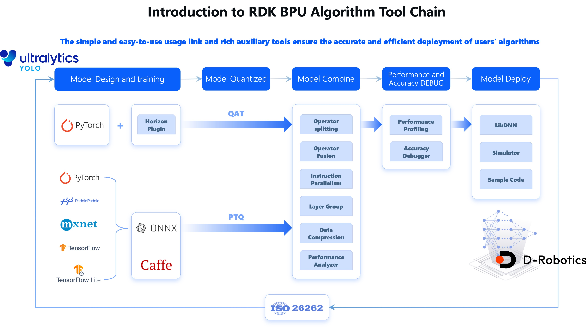

NVIDIA Tensor RT:

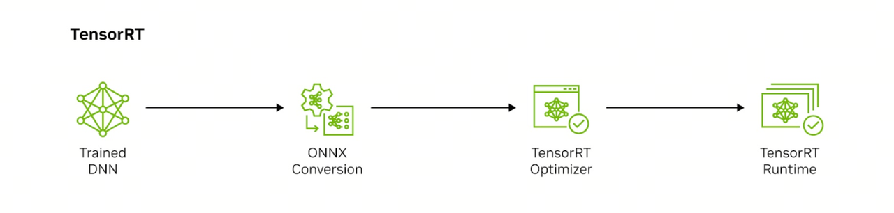

NVIDIA Tensor RT: https://developer.nvidia.cn/tensorrt

## RDK Model Zoo

How to compile a highly efficient BPU model for TROS to use? Here, the part of YOLO in the RDK Model Zoo needs to be referred to.

Note that, consistent with TensorRT, the toolchain of BPU is an open toolchain, and the deployment methods are not unique. You can design different deployment methods based on your own experience and actual needs, and write post-processing programs that suit your own deployment methods. Model Zoo maintains some equivalent modification methods with relatively high performance.

### RDK S100 Plus / RDK S100 Model Zoo

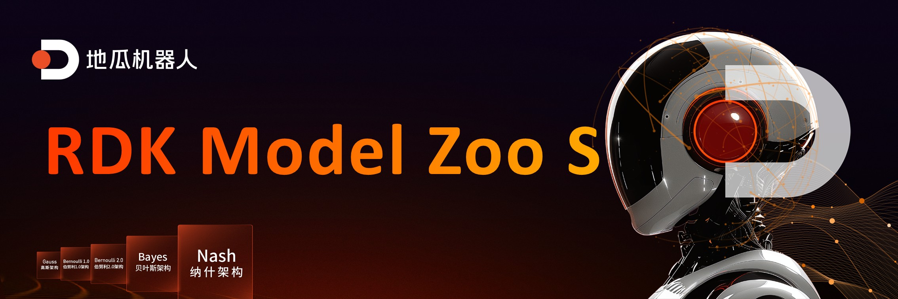

https://github.com/D-Robotics/rdk_model_zoo_s

### RDK X5 Model Zoo

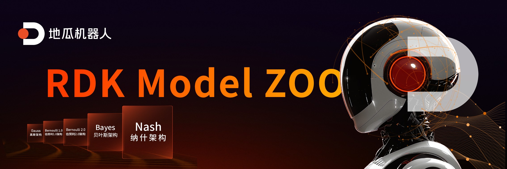

https://github.com/D-Robotics/rdk_model_zoo

### Usage method

When you obtain a Model by referring to the method of Model Zoo, you can modify the workconfig.json file of TROS 'dnn_node.

The current adaptation status is as follows

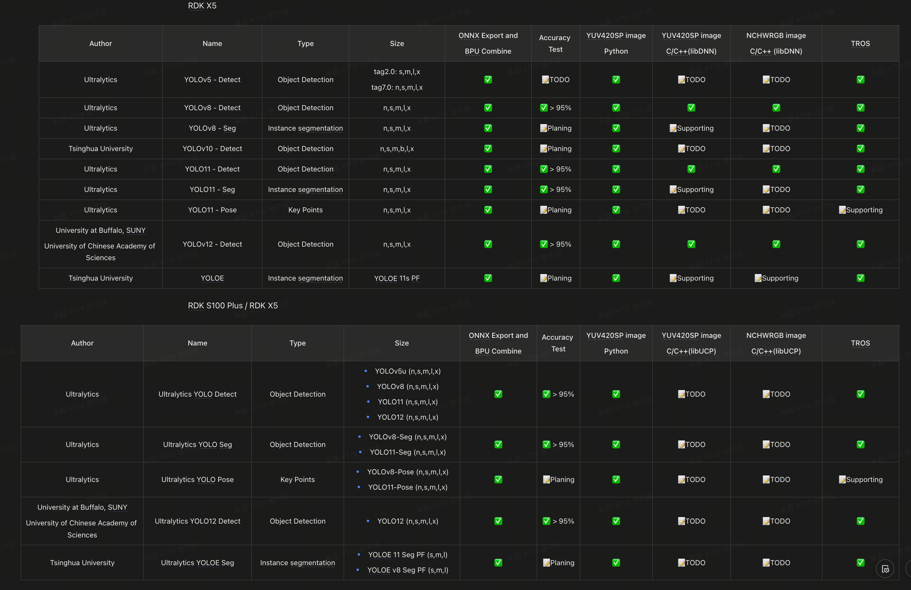

### Conclusion

This article introduces how to efficiently use the YOLO algorithm in RDK's robot operating system (ROS2). The main idea is to use Ultralytics YOLO for training, Model Zoo for transformation and verification, and RDK TROS for efficient Runtime.

