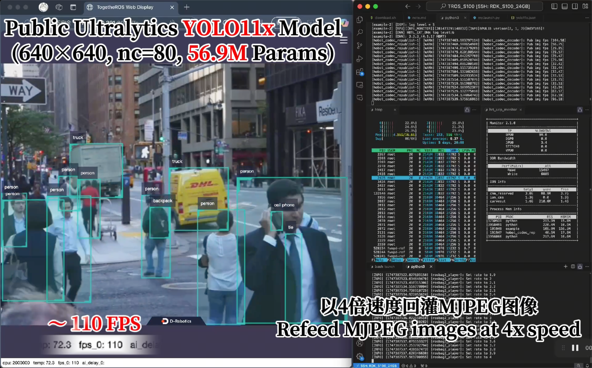
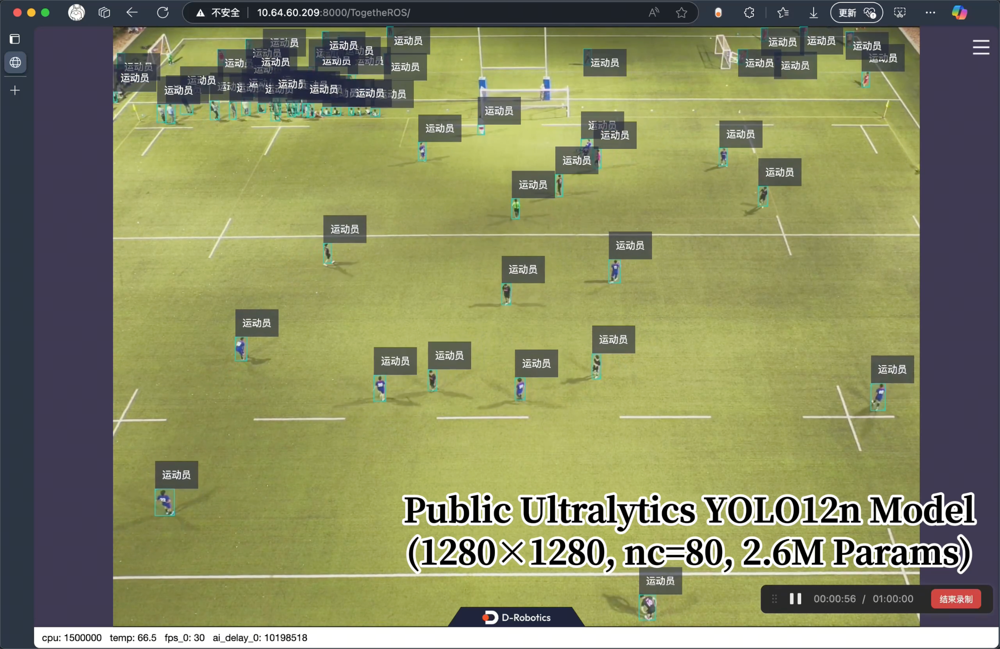
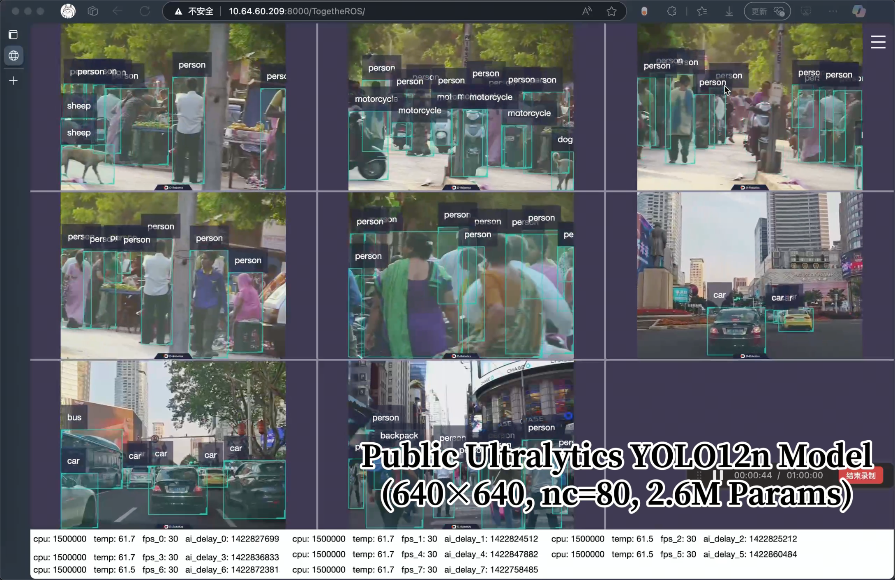
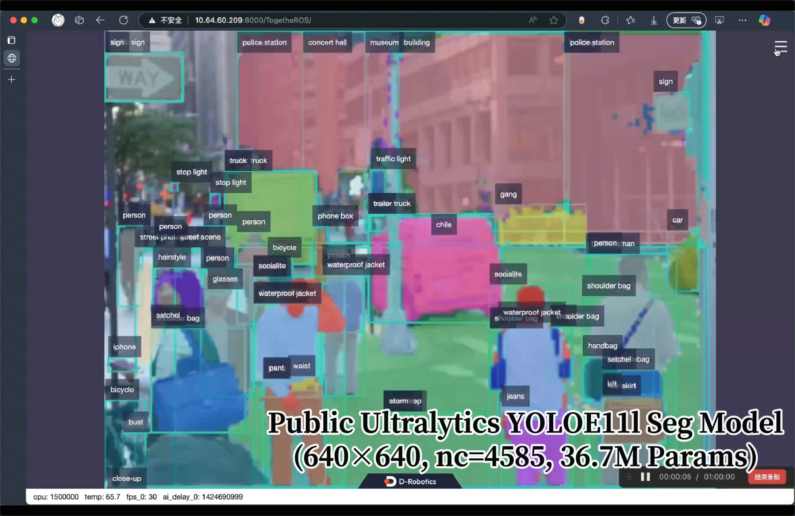
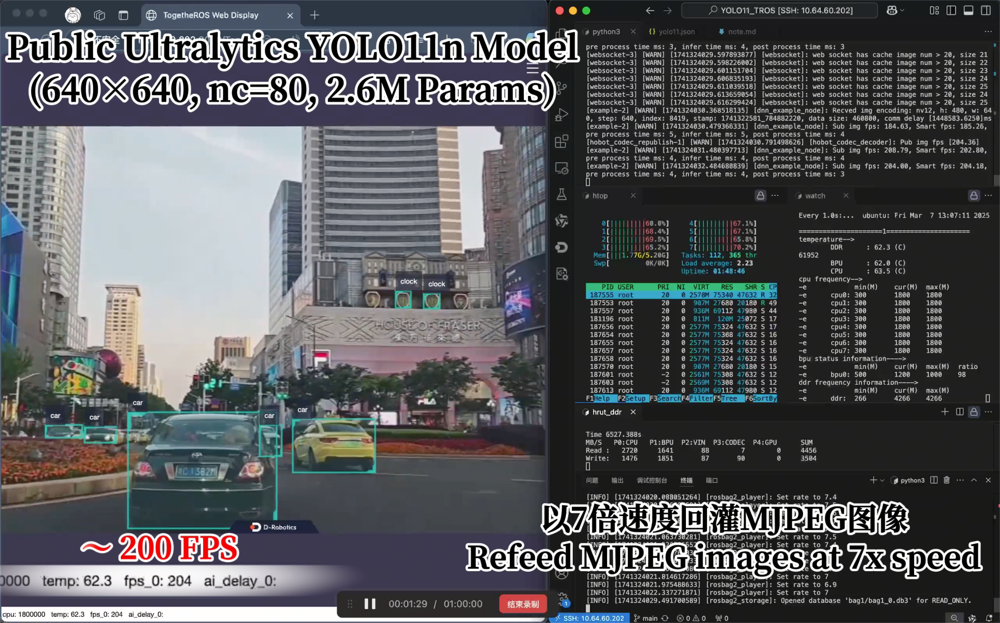
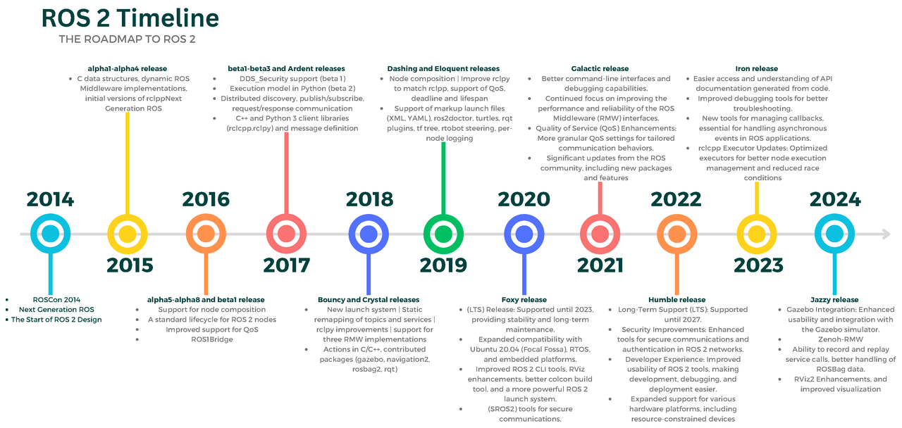
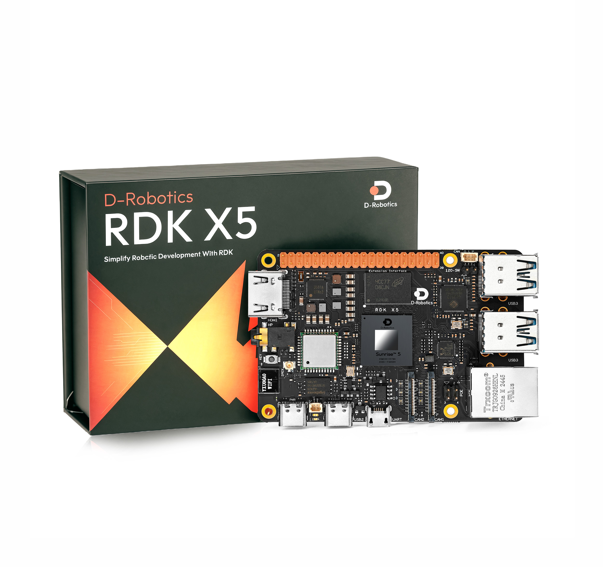
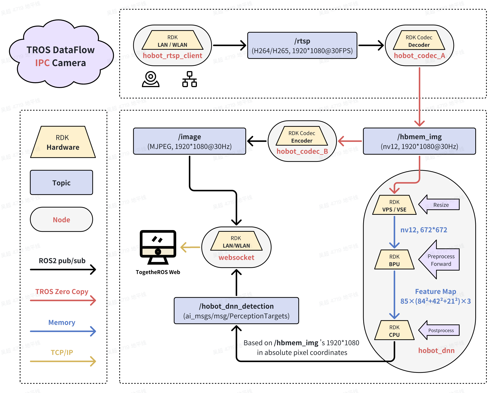
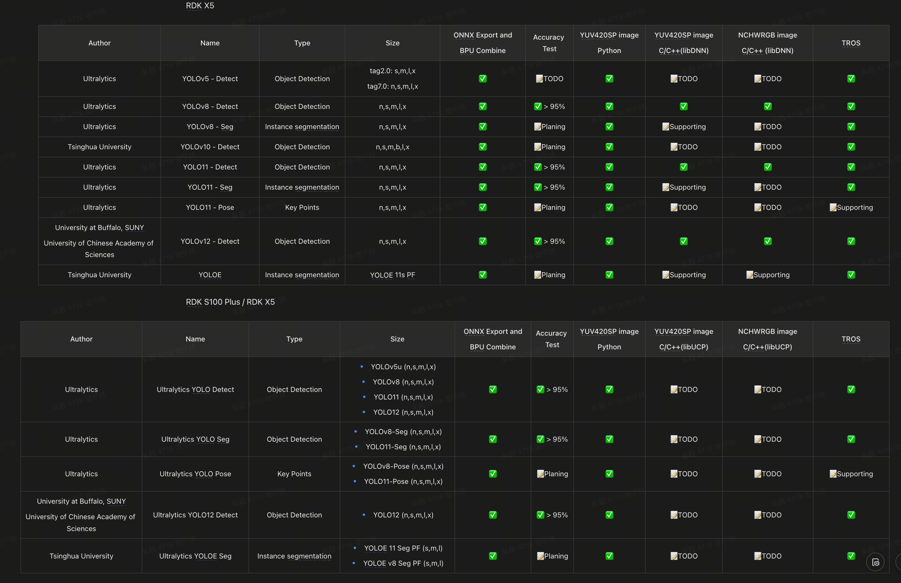

# 如何在RDK的机器人操作系统(ROS2)中高效使用YOLO算法?

## Demo Videos

### RDK S100 Plus / RDK S100

#### YOLO11x, 640x640, 80 Classes, e2e 110FPS

https://www.bilibili.com/video/BV1EUE4zgE2V

#### YOLO12n, 1280x1280, 80 Classes, e2e 30FPS

https://www.bilibili.com/video/BV1JyjGzfEEW

#### 8 Channel YOLO12n, 640x640, 80 Classes, e2e 8 x 30 FPS

https://www.bilibili.com/video/BV1RXjGzpEBU

#### YOLOE 11 l Seg, Prompt Free, 640x640, 4585 Classes, e2e 30FPS

https://www.bilibili.com/video/BV1EyjGzfEy6

### RDK X5

#### YOLO11n, 640x640, 80 Classes, e2e 200FPS

https://www.bilibili.com/video/BV1NN91Y1EBP

#### YOLOv8n, 640x640, 80 Classes, e2e 220FPS

https://www.bilibili.com/video/BV12h41eYEer

#### YOLOv8n Seg, 640x640, 80 Classes, e2e 166FPS

https://www.bilibili.com/video/BV1xE4UeuEJh

## Introduction to ROS2

机器人操作系统（ROS）是一组用于构建机器人应用程序的软件库和工具。从驱动程序和最先进的算法到强大的开发人员工具，ROS拥有您下一个机器人项目所需的开源工具。

自从2007年ROS开始以来，机器人和ROS社区发生了很多变化。ROS 2项目的目标是适应这些变化，利用ROS 1的优点并改进缺点。

ROS中的每个节点应负责单个模块目的 (例如，一个用于控制车轮电机的节点，一个用于控制激光测距仪的节点等)。每个节点可以通过话题、服务、动作或参数向其他节点发送和接收数据, 一个完整的机器人系统由许多协同工作的节点组成。

这些节点的开发者可以是硬件厂商, 软件厂商, 算法工程师, 机器人工程师等. 只要我们的节点符合ROS2的规范，就可以轻松的集成进一个庞大的机器人系统.

- [ROS2 英文手册](https://docs.ros.org/en/rolling/index.html)
- [ROS2 中文手册](http://dev.ros2.fishros.com/doc/)

## Introduction to Ultralytics YOLO

最新版本的广受好评的实时目标检测和图像分割模型Ultralytics YOLO11。YOLO11是建立在深度学习和计算机视觉的前沿进展，在速度和准确性方面提供无与伦比的性能。它的流线型设计使其适用于各种应用程序，并易于适应不同的硬件平台，从边缘设备到云API。

Ultralytics YOLO11是一个通用的AI框架，支持多种计算机视觉任务。该框架可用于执行检测、分割、OBB、分类和姿态估计。这些任务中的每一个都有不同的目标和用例，允许您使用单个框架解决各种计算机视觉挑战。

- [Ultralytics](https://www.ultralytics.com/)
- [Ultralytics YOLO Document](https://docs.ultralytics.com/)
- [Ultralytics YOLO GitHub](https://github.com/ultralytics/ultralytics)

## Inteoration to D-RObotics RDK

### D-Robotics

地瓜机器人是专注机器人智能进化的底层基础设施提供商，通过提供高性能计算芯片和软硬协同、端云一体的全链路开发平台，全方位助力机器人开发与规模化落地，为人们带来更智能、更美好的体验。

- [地瓜机器人中文官网](https://d-robotics.cc/)
- [地瓜机器人英文官网](https://en.d-robotics.cc/)
- [地瓜开发者社区](https://developer.d-robotics.cc/)

### RDK S100 Plus / RDK S100

- CPU: 6 x A78AE @ 2.0GHz / 6 x A78AE @ 1.5GHz
- BPU: 128TOPs @ int8 / 80TOPs @ int8
- DDR: LPDDR5@6400，96bit / LPDDR5@6400，96bit
- OS: RDK OS Based on Ubuntu 22.04

RDK S100 是地瓜机器人面向具身智能和机器人场景推出的高性能、大算力模组, 独特的异构设计可以同时兼顾感知推理和实时运动控制的需求, 减少控制系统的体积和复杂度.

- [RDK S100 介绍(中文)](https://developer.d-robotics.cc/rdks100)

### RDK X5

- CPU: 8 x A55 @ 1.5 GHz
- BPU: 10 TOPs @ int8
- DDR: LPDDR4@4266, 32bit
- OS: RDK OS Based on Ubuntu 22.04

D-Robotics RDK X5搭载Sunrise 5智能计算芯片，可提供高达10 Tops的算力，是一款面向智能计算与机器人应用的全能开发套件，接口丰富，极致易用，支持Transformer、RWKV、Occupancy、Stereo Perception等多种复杂模型和最新算法，加速智能化应用快速落地。

- [RDK X5 介绍(中文)](https://developer.d-robotics.cc/en/rdkx5)
- [RDK X5 介绍(英文)](https://developer.d-robotics.cc/rdkx5)

## Inteoration to TogetheROS.Bot (TROS)

TogetheROS.Bot是D-Robotics面向机器人厂商和生态开发者推出的机器人操作系统，旨在释放机器人场景的智能潜能，助力生态开发者和商业客户能够高效、便捷的进行机器人开发，打造具有竞争力的智能机器人产品。

TogetheROS.Bot支持在RDK平台上运行，同时提供模拟器版本在X86平台上运行。RDK平台涵盖下图所示的全部功能，X86平台支持以图片回灌方式体验部分功能，提高用户算法开发和验证效率，并能够快速迁移到RDK平台。

### RDK TROS USB Camera DataFlow

### RDK TROS MIPI Camera DataFlow

### RDK TROS IPC Camera DataFlow

通过标准的ROS2 Humble 节点的的组合, TROS 可以对 USB、MIPI 和 IPC摄像头的数据进行智能分析. 同时也支持搭建多路并行式的视频流智能分析应用。

1. IPC摄像头节点

TROS手册：https://developer.d-robotics.cc/rdk_doc/Robot_development/apps/video_boxs

对应GitHub仓库地址：https://github.com/D-Robotics/hobot_rtsp_client

2. MIPI摄像头节点

TROS手册：https://developer.d-robotics.cc/rdk_doc/Robot_development/quick_demo/demo_sensor#mipi%E5%9B%BE%E5%83%8F%E9%87%87%E9%9B%86

对应GitHub仓库地址：https://github.com/D-Robotics/hobot_mipi_cam

3. USB摄像头节点

TROS手册：https://developer.d-robotics.cc/rdk_doc/Robot_development/quick_demo/demo_sensor#usb%E5%9B%BE%E5%83%8F%E9%87%87%E9%9B%86

对应GitHub仓库地址：https://github.com/D-Robotics/hobot_usb_cam

4. Codec节点：

TROS手册：https://developer.d-robotics.cc/rdk_doc/Robot_development/quick_demo/hobot_codec

对应GitHub仓库地址：https://github.com/D-Robotics/hobot_codec
   
5. hobot_dnn 算法多线程推理节点
TROS手册：https://developer.d-robotics.cc/rdk_doc/Robot_development/boxs/detection/yolo

对应GitHub仓库地址：https://github.com/D-Robotics/hobot_dnn

6. websocket 可视化节点

TROS手册：https://developer.d-robotics.cc/rdk_doc/Robot_development/quick_demo/demo_render#web%E5%B1%95%E7%A4%BA

对应GitHub仓库地址：https://github.com/D-Robotics/hobot_websocket

## 如何在RDK的BPU上加速YOLO?

RDK 开发板使用了BPU（Brain Process Unit）来进行神经网络加速，这种处理器属于 NPU（神经网络处理单元）的一种。我们的 BPU 使用方式与 NVIDIA 的 TensorRT 非常相似，并且我们支持两种神经网络量化方案：**训练后量化（Post-Training Quantization, PTQ）** 和 **感知量化训练（Quantization-Aware Training, QAT）**。通常情况下，PTQ 所能达到的精度已经足够满足日常应用需求，而 QAT 更适合对精度要求更高的高级应用场景。

在 PTQ 方案下，我们使用 Ultralytics 的 YOLO 导出一个 ONNX 模型。该 ONNX 模型经过量化和编译之后，就可以被转换为可在 BPU 上加速运行的模型。

Ours:

NVIDIA Tensor RT 示例图：

NVIDIA Tensor RT: https://developer.nvidia.cn/tensorrt

## RDK Model Zoo

如何编译出高效率的BPU模型给TROS使用？这里需要参考RDK Model Zoo中的YOLO的部分.

### RDK S100 Plus / RDK S100 Model Zoo

https://github.com/D-Robotics/rdk_model_zoo_s

### RDK X5 Model Zoo

https://github.com/D-Robotics/rdk_model_zoo

### 使用方法

当你参考Model Zoo的方法获得一个模型后, 修改TROS的dnn_node的workconfig.json文件即可. 

### 目前的适配情况如下

